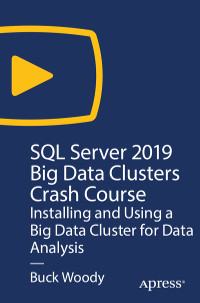

# Apress Source Code

This repository accompanies [*SQL Server 2019 Big Data Clusters Crash Course*](https://rd.springer.com/video/10.1007/978-1-4842-6021-0) by Buck Woody (Apress, 2020).

[comment]: #cover

Download the files as a zip using the green button, or clone the repository to your machine using Git.

## Releases

Release v1.0 corresponds to the code in the published book, without corrections or updates.

## Contributions

See the file Contributing.md for more information on how you can contribute to this repository.